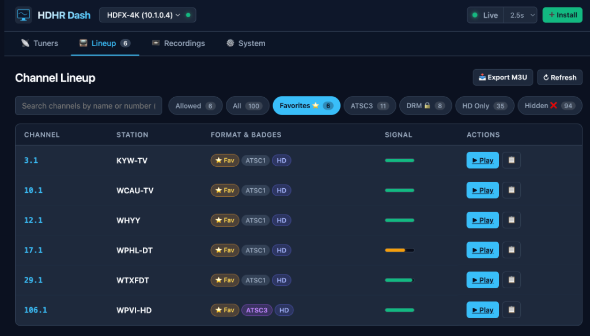

# HDHR Dash

[](https://jay0lee.github.io/hdhr-dash/)
[](https://jay0lee.github.io/hdhr-dash/)
[](LICENSE)

A modern, fast, and responsive **Progressive Web App (PWA)** to monitor and interact with [SiliconDust HDHomeRun](https://www.silicondust.com/) tuners and DVR recording engines on your local network.

👉 **Live App:** [https://jay0lee.github.io/hdhr-dash/](https://jay0lee.github.io/hdhr-dash/)

---

## Screenshots

### 📡 Tuner Activity & Status
Monitor physical tuners in real time with live polling, client IP resolution, network bitrate, and signal metrics (Signal Strength, SNR Quality, Symbol Quality).


---

### 📺 Channel Lineup
Browse your entire channel lineup with ATSC 1.0 vs ATSC 3.0 detection, A3SA DRM badges, and color-coded signal quality bars with tooltips.



---

### 📼 DVR & Recordings
View your connected storage (e.g., USB SSD) usage, browse recorded series and episodes with broadcast artwork and station logos, and check scheduled recording rules.


---

### ⚙️ System & Device Management
View device hardware details, switch between multiple tuners, and run cloud auto-discovery.


---

## Features

* **📡 Real-Time Tuner Monitoring:**
  * Displays physical tuners (`tuner0` – `tuner3`) with live polling (`1s`, `2.5s`, `5s`, or paused).
  * Automatically resolves internal `[::1]` streaming proxies to the actual streaming client's LAN IP.
  * Live stream bitrate indicator (e.g. `1.54 Mbps`).
  * Signal strength, SNR quality, and symbol quality gauges.
  * Smart polling lifecycle that automatically pauses when the browser tab is hidden to conserve network and battery.

* **📺 Channel Lineup & Streaming:**
  * Full channel discovery via `?show=found`, displaying all scanned channels (including hidden ones).
  * **ATSC3 vs ATSC1:** Clear badges identifying NextGen TV (HEVC / AC-4) vs standard digital channels.
  * **A3SA DRM Badges:** Highlights encrypted ATSC 3.0 channels with `🔒 DRM` indicators.
  * **Signal Quality Meters:** Color-coded signal bars (🟢 Green $\ge 80\%$, 🟡 Yellow $\ge 60\%$, 🔴 Red $< 60\%$) with detailed hover tooltips (`Quality: 100% | Strength: 74%`).
  * **Quick Filters:** Filter by *Allowed*, *All*, *Favorites ⭐*, *ATSC3*, *DRM 🔒*, *HD Only*, and *Hidden ❌*.
  * **Direct Streaming & M3U Export:** One-click stream launch, clipboard URL copy, and complete `#EXTM3U` playlist download.

* **📼 DVR & Storage Engine:**
  * Automatically detects attached storage (e.g., USB SSD on HDHomeRun FLEX 4K or network recording engines).
  * Visual storage space bar (`Free GB` vs `Total GB`).
  * **Series & Episodes Views:** Browse grouped series cards or drill down into individual episodes with season/episode numbers, original airdates, station logos, synopses, and direct `▶ Play` links.
  * **Scheduled Rules:** Integrates with SiliconDust's Cloud DVR API (`api.hdhomerun.com/api/recording_rules`) using `DeviceAuth` to show active series recording rules with priority, team/channel filters, and padding.

* **⚙️ Multi-Device & Discovery:**
  * Auto-discovers HDHomeRun devices on your LAN using SiliconDust's Cloud Discovery API (`api.hdhomerun.com/discover`).
  * Supports manual IP entry and instant device switching.
  * Displays model number, Device ID, firmware version, tuner count, and storage URL.

* **📱 Progressive Web App (PWA):**
  * Fully installable on macOS, Windows, iOS, and Android.
  * Zero external framework dependencies — pure Vanilla JavaScript, CSS3, and HTML5.
  * Works offline with service worker caching for the app shell.

---

## How It Works (LAN Access from HTTPS)

Modern browsers typically restrict HTTPS public websites (like GitHub Pages) from making requests to private LAN IP addresses (`10.x.x.x` or `192.168.x.x`). 

HDHR Dash works seamlessly thanks to:
1. **Built-in CORS Support:** SiliconDust HDHomeRun firmware serves `Access-Control-Allow-Origin: *` on its JSON endpoints.
2. **Local Network Access (LNA):** When you first load the dashboard, Chrome displays a permission prompt asking:  
   * *"Allow this site to access devices on your local network?"*  
   Approving this prompt allows the web app to query your HDHomeRun over HTTP without mixed-content blocking.

---

## Running Locally

If you prefer to run HDHR Dash locally instead of using GitHub Pages:

```bash
# Clone the repository
git clone https://github.com/jay0lee/hdhr-dash.git
cd hdhr-dash

# Serve using any static file server
python3 -m http.server 8080
```

Open `http://localhost:8080` in your browser.

---

## License

Apache License 2.0. See [LICENSE](LICENSE) for details.
