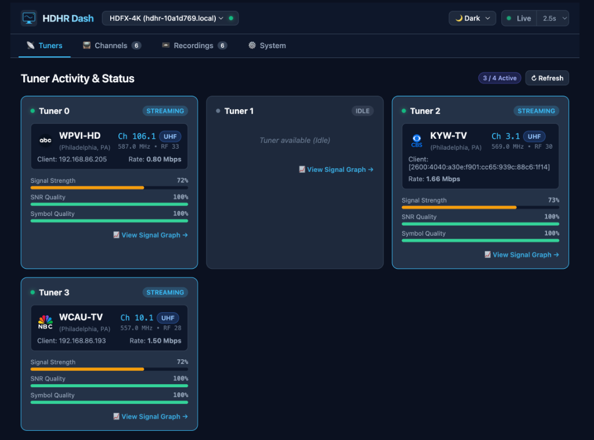
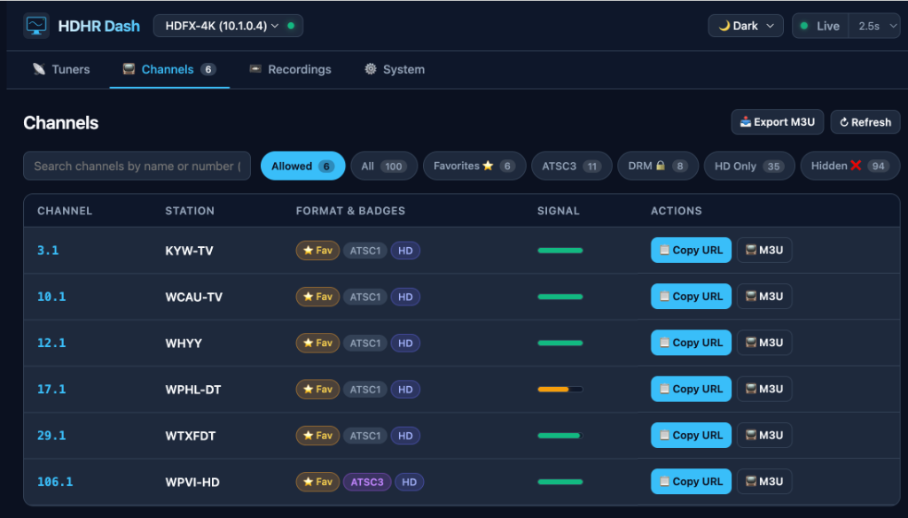
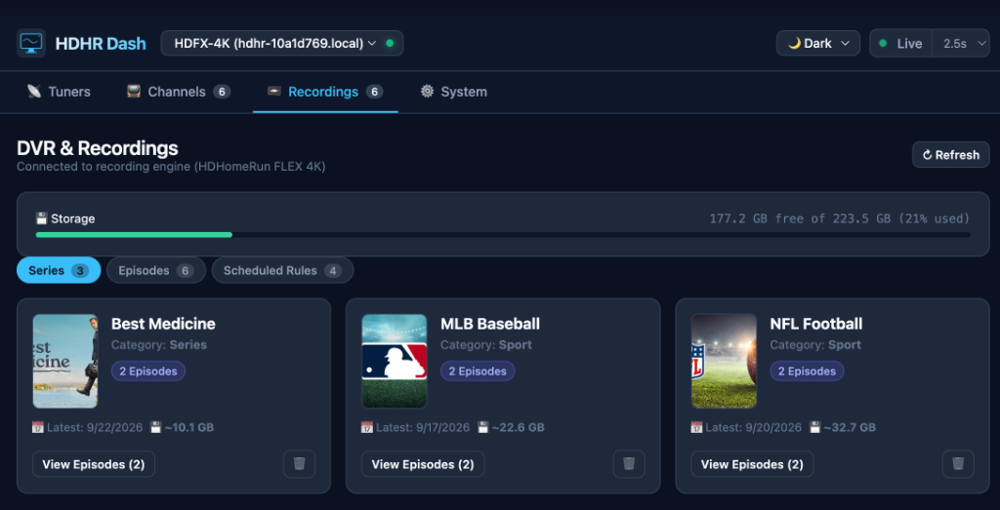
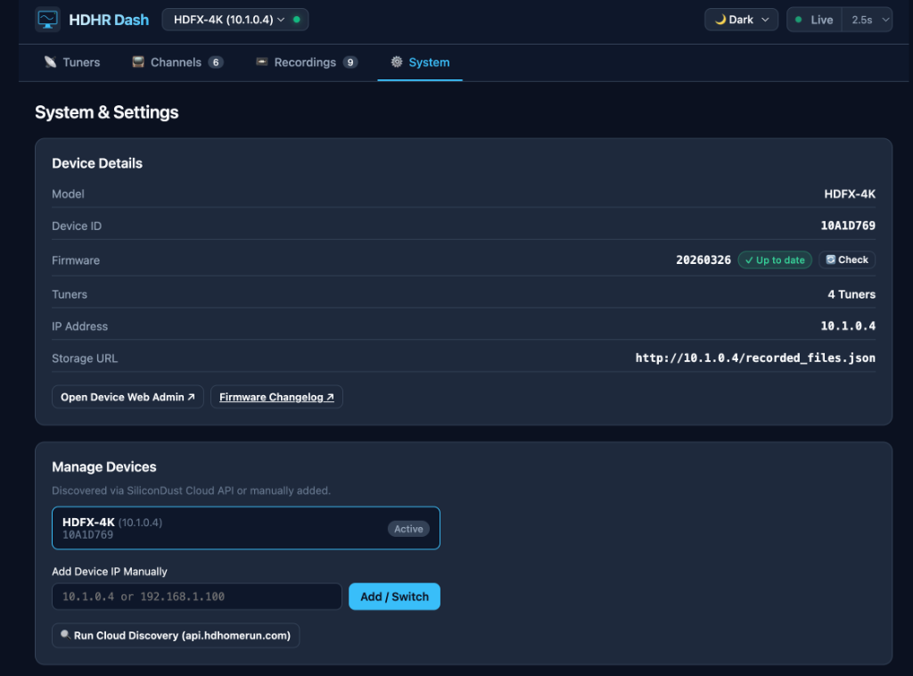

# HDHR Dash

[](https://jay0lee.github.io/hdhr-dash/)
[](https://jay0lee.github.io/hdhr-dash/)
[](LICENSE)

A modern, fast, and responsive **Progressive Web App (PWA)** to monitor and interact with [SiliconDust HDHomeRun](https://www.silicondust.com/) tuners and DVR recording engines on your local network.

👉 **Live App:** [https://jay0lee.github.io/hdhr-dash/](https://jay0lee.github.io/hdhr-dash/)

---

## Screenshots

### 📡 Tuner Activity & Status
Monitor physical tuners in real time with live polling, client IP resolution, network bitrate, signal gauges (Signal Strength, SNR Quality, Symbol Quality), and tuner sharing detection when multiple clients or DVR recordings share a tuner.



---

### 📺 Channels
Browse your entire channel lineup with ATSC 1.0 vs ATSC 3.0 detection, A3SA DRM badges, color-coded signal quality meters, quick filters, one-click stream URL copying, M3U launchers, and full playlist export.



---

### 📼 DVR & Recordings
View connected storage usage, browse recorded series and episodes with broadcast poster artwork and station logos, inspect scheduled recording rules, and download full `.mpg` video files directly.



---

### ⚙️ System & Device Management
View device hardware details, check firmware update status against SiliconDust releases, switch between multiple tuners, and customize the interface with 5 color themes.



---

## Features

* **📡 Real-Time Tuner Monitoring:**
  * Displays physical tuners (`tuner0` – `tuner3`) with live polling (`1s`, `2.5s`, `5s`, or paused).
  * **Tuner Sharing Detection:** Automatically detects when multiple clients or DVR recording sessions share a single tuner on the same channel, displaying a `Shared (N)` badge and individual client tags (e.g. `192.168.86.193`, `📼 DVR`).
  * Automatically resolves internal `[::1]` streaming proxies to the actual streaming client's LAN IP.
  * Live stream bitrate indicator (e.g. `2.87 Mbps`) or broadcast frequency.
  * Signal strength, SNR quality, and symbol quality gauges with color grading (🟢 Good, 🟡 Fair, 🔴 Poor).
  * Smart polling lifecycle that automatically pauses when the browser tab is hidden to conserve network and battery.

* **📺 Channels & Streaming:**
  * Full channel discovery via `?show=found`, displaying all scanned channels (including hidden ones).
  * **ATSC 3.0 vs ATSC 1.0:** Clear badges identifying NextGen TV (HEVC / AC-4) vs standard digital channels.
  * **A3SA DRM Badges:** Highlights encrypted ATSC 3.0 channels with `🔒 DRM` indicators.
  * **Signal Quality Meters:** Color-coded signal bars (🟢 Green $\ge 80\%$, 🟡 Yellow $\ge 60\%$, 🔴 Red $< 60\%$) with detailed hover tooltips (`Quality: 100% | Strength: 75%`).
  * **Quick Filters:** Filter by *Allowed*, *All*, *Favorites ⭐*, *ATSC3*, *DRM 🔒*, *HD Only*, and *Hidden ❌*.
  * **Direct Streaming & M3U Export:** One-click clipboard URL copy (`📋 Copy URL`), M3U playlist launcher (`📺 M3U`) for external video players (VLC, IINA, etc.), and complete `#EXTM3U` playlist download for external IPTV players, Plex, Channels DVR, or Kodi.

* **📼 DVR & Storage Engine:**
  * Automatically detects attached storage (e.g., connected USB drive on HDHomeRun FLEX 4K or network recording engines).
  * Visual storage space bar (`Free GB` vs `Total GB` and % used).
  * **Series & Episodes Views:** Browse grouped series cards or drill down into individual episodes with season/episode numbers, original airdates, broadcast poster artwork, synopses, and station details.
  * **Direct Video Downloads:** Direct `⬇️ Download (.mpg)` button for every recorded file to save full raw video files directly to your device.
  * **Recording Deletion & Management:** Delete individual recorded files or entire series directly from connected storage via HDHomeRun DVR API `CmdURL` POST commands, with confirmation prompts and a "Don't ask again" option.
  * **Scheduled Rules:** Integrates with SiliconDust's Cloud DVR API (`api.hdhomerun.com/api/recording_rules`) using `DeviceAuth` to show active series recording rules with priority, team/channel filters, and padding.

* **🎨 Theme Customization:**
  * 5 selectable color themes:
    * **Dark** (Default slate & sky blue)
    * **Light** (Clean modern daylight palette)
    * **OLED Black** (True pitch-black background with vibrant accents)
    * **Teal** (HDHomeRun classic brand aesthetic)
    * **Nord Frost** (Arctic blue & cool gray palette)
  * Theme preference persists automatically across sessions.

* **⚙️ Multi-Device & Firmware Management:**
  * Displays model number, Device ID, firmware version, tuner count, IP address, and storage URL.
  * **Firmware Update Check:** Natively checks for firmware updates, showing `✓ Up to date` or `Update Available` with direct links to the device web admin and SiliconDust firmware changelog.
  * Multi-device support: Save multiple HDHomeRun units and switch between them instantly.
  * Clean, stacked vertical cards preventing text and URL overflow on all screen sizes.

* **📱 Progressive Web App (PWA):**
  * Fully installable on macOS, Windows, iOS, and Android.
  * Complete icon and favicon suite (`favicon.ico`, `apple-touch-icon.png`, `icon-192.png`, `icon-512.png`).
  * Zero external framework dependencies — pure Vanilla JavaScript, CSS3, and HTML5.
  * Works offline with service worker caching for the app shell.

---

## How It Works (LAN Access from HTTPS)

Modern browsers restrict HTTPS public websites (like GitHub Pages) from making requests to private LAN IP addresses (`10.x.x.x` or `192.168.x.x`). 

HDHR Dash works seamlessly thanks to:
1. **Built-in CORS Support:** SiliconDust HDHomeRun firmware serves `Access-Control-Allow-Origin: *` on its JSON endpoints.
2. **Local Network Access (LNA):** When you first load the dashboard, Chrome displays a permission prompt asking:  
   * *"Allow this site to access devices on your local network?"*  
   Approving this prompt allows the web app to query your HDHomeRun over HTTP without mixed-content blocking.

---

## Running Locally

If you prefer to run HDHR Dash locally instead of using GitHub Pages:

```bash
# Clone the repository
git clone https://github.com/jay0lee/hdhr-dash.git
cd hdhr-dash

# Serve using any static file server
python3 -m http.server 8080
```

Open `http://localhost:8080` in your browser.

---

## License

Apache License 2.0. See [LICENSE](LICENSE) for details.
